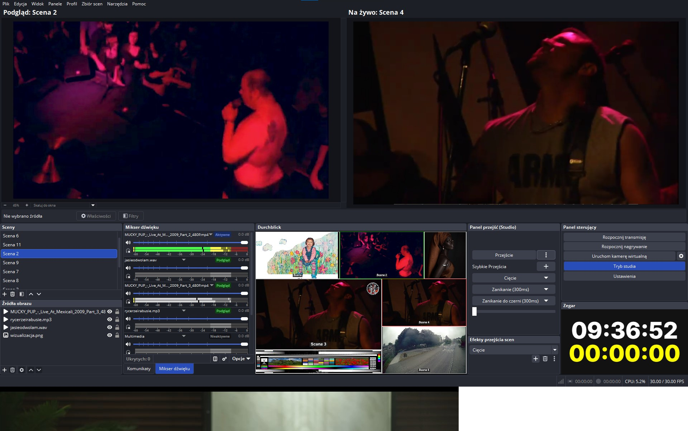

# Studio No Transition Strip

This OBS Studio plugin moves the transition strip (containing the Transition button, T-bar, and quick transitions) from between the Preview and Program views in Studio Mode into a movable dock panel. This allows the Preview and Program windows to be placed directly side-by-side.

## Features
*   **Movable Dock**: Transition strip can be placed anywhere in OBS.
*   **Transition Control**: Includes a dedicated menu action and hotkey to trigger the transition.
*   **Dock Toggle**: Option to quickly return the strip to the main window layout.
*   **Locales**: Supported in English (en-US) and Polish (pl-PL).

## Installation
1. Download the latest release ZIP file.
2. Extract the contents.
3. Copy `studio-no-transition-strip.dll` to:
   `C:\Program Files\obs-studio\obs-plugins\64bit\`
4. Copy the `locale` folder content to:
   `C:\Program Files\obs-studio\data\obs-plugins\studio-no-transition-strip\locale\`
5. Restart OBS Studio.

## Known Limitations
*   Due to OBS Studio architecture, a small gap may remain between the Preview and Program panels even when the strip is moved. This plugin cannot modify the internal layout container spacing of OBS Studio itself.

## Development & Build Requirements
*   **Environment**: Windows 10/11 x64.
*   **Tools**:
    *   Visual Studio 2019 (BuildTools with MSVC 14.29) or newer.
    *   CMake ≥ 3.20.
    *   Qt 6.11.1 (or compatible OBS-shipped version).
*   **Dependencies**: Requires pre-built OBS dependencies (`obs-deps` 2025-07-11), OBS 32.2.2 source tree, and `libobs` headers.
*   **Build**: Use `Visual Studio 16 2019` generator. Configure with `ENABLE_FRONTEND_API=true` and `ENABLE_QT=true`.

## Versioning
Version numbers follow a semantic-like increment (`+0.1` minor) for every successful build iteration.

## Licensing and Attribution
*   **License**: MIT License (Copyright (c) 2026 studiokrause).
*   **Attribution**: This code was developed with the assistance of AI models: **Google Gemini 3.1 Flash Lite** and **Muse Spark 1.3 Contributor**.
